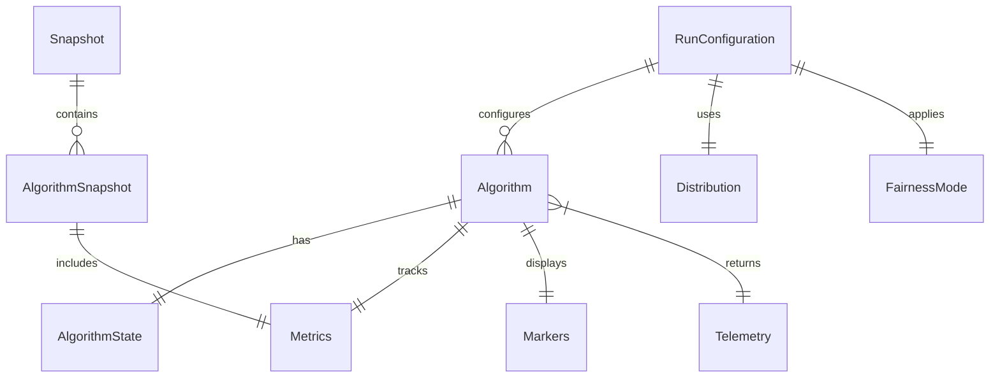

# Data Model: Sorting Race Visualization

## Core Entities

### Algorithm
Represents a single sorting algorithm instance participating in the race.

**Fields**:
- `name: String` - Algorithm display name (e.g., "Bubble Sort", "Quick Sort")
- `state: AlgorithmState` - Current execution state
- `array: Vec<i32>` - Current array state (copy-on-write)
- `metrics: Metrics` - Performance counters
- `markers: Markers` - Visual indicators for current operations
- `enabled: bool` - Whether algorithm is active in race

**State Transitions**:
```
Ready → Running → Paused → Running → Complete
         ↓                    ↑
         └────────────────────┘
```

### AlgorithmState
Enumeration of possible algorithm states.

**Variants**:
- `Ready` - Initialized but not started
- `Running` - Actively sorting
- `Paused` - Temporarily halted
- `Complete` - Sorting finished

### Metrics
Tracks performance and resource usage for each algorithm.

**Fields**:
- `comparisons: u64` - Total comparison operations
- `moves: u64` - Total move/swap operations (swap = 2 moves)
- `steps_per_sec: f32` - Current throughput (rolling average)
- `progress_percent: f32` - Estimated completion (0.0-100.0)
- `memory_current: usize` - Current auxiliary memory (bytes)
- `memory_peak: usize` - Maximum auxiliary memory used (bytes)
- `step_count: u64` - Total steps executed

**Invariants**:
- `memory_peak >= memory_current`
- `0.0 <= progress_percent <= 100.0`
- `moves` counts individual element moves (swap = 2 moves)

### Markers
Visual indicators for algorithm-specific operations.

**Fields**:
- `pivot: Option<usize>` - Current pivot index (Quick Sort)
- `heap_boundary: Option<usize>` - Heap/sorted boundary (Heap Sort)
- `merge_runs: Vec<(usize, usize)>` - Active merge regions (Merge Sort)
- `cursors: Vec<usize>` - Current comparison positions
- `gap: Option<usize>` - Current gap size (Shell Sort)

### RunConfiguration
Defines parameters for a sorting race session.

**Fields**:
- `array_size: usize` - Number of elements (clamped to terminal width)
- `distribution: Distribution` - Input array pattern
- `seed: u64` - Random seed for determinism
- `fairness_mode: FairnessMode` - Step allocation strategy
- `target_fps: u32` - Rendering frame rate (25-35)

### Distribution
Input array generation patterns.

**Variants**:
- `Shuffled` - Random permutation (default)
- `NearlySorted` - 90% sorted with small perturbations
- `Reversed` - Descending order
- `FewUnique` - Limited distinct values (√N unique)

### FairnessMode
Strategy for allocating steps to algorithms.

**Variants**:
- `ComparisonBudget { k: usize }` - K comparisons per tick (default K=16)
- `Weighted { alpha: f32, beta: f32 }` - α·comparisons + β·moves
- `WallTime { slice_ms: u64 }` - Time-based allocation

### Telemetry
Per-step information returned by algorithms.

**Fields**:
- `comparisons_made: usize` - Comparisons in this step
- `moves_made: usize` - Moves in this step
- `memory_delta: isize` - Memory change this step
- `highlights: Vec<usize>` - Indices to highlight
- `status_text: String` - Current operation description
- `progress_hint: f32` - Algorithm's progress estimate

### Snapshot
Complete state capture for save/replay.

**Fields**:
- `timestamp: String` - ISO 8601 timestamp
- `configuration: RunConfiguration` - Run parameters
- `elapsed_ms: u64` - Time since start
- `algorithms: Vec<AlgorithmSnapshot>` - Per-algorithm state
- `version: String` - Application version

### AlgorithmSnapshot
Algorithm state within a snapshot.

**Fields**:
- `name: String` - Algorithm identifier
- `array: Vec<i32>` - Current array state
- `metrics: Metrics` - Performance counters
- `state: AlgorithmState` - Execution state
- `enabled: bool` - Active status

## Relationships



## Validation Rules

### RunConfiguration
- `1 <= array_size <= terminal_width`
- `25 <= target_fps <= 35`
- `seed` must be reproducible across platforms

### Metrics
- Comparisons and moves monotonically increase
- Memory tracking only counts auxiliary space
- Progress estimation based on algorithm-specific heuristics

### Markers
- All indices must be within array bounds
- Merge runs must not overlap
- Pivot must be valid when set

## State Management

### Initialization
1. Parse CLI arguments → RunConfiguration
2. Generate input array based on Distribution
3. Initialize each Algorithm with array copy
4. Reset all Metrics to zero
5. Set all states to Ready

### Step Execution
1. FairnessMode allocates budget to each algorithm
2. Each algorithm executes within budget
3. Telemetry returned and metrics updated
4. Markers updated based on current operation
5. Progress calculated from algorithm hints

### Snapshot Creation
1. Pause all algorithms
2. Serialize current state to Snapshot
3. Write JSON to `./runs/race-{timestamp}.json`
4. Resume algorithms

## Memory Accounting

### Per-Algorithm Overhead
- **Bubble/Insertion/Selection**: O(1) - index variables only
- **Shell**: O(1) - gap sequence pre-computed
- **Quick**: O(log N) - iterative stack (max 2⌈log₂ N⌉)
- **Heap**: O(1) - in-place heapification
- **Merge**: O(N) - temporary merge buffer

### Tracking Rules
- Count bytes allocated beyond input array
- Track current and peak separately
- Include stack space for Quick Sort
- Reusable buffers count once

## JSON Schema (Snapshot)

```json
{
  "$schema": "http://json-schema.org/draft-07/schema#",
  "type": "object",
  "required": ["timestamp", "configuration", "elapsed_ms", "algorithms", "version"],
  "properties": {
    "timestamp": { "type": "string", "format": "date-time" },
    "configuration": {
      "type": "object",
      "properties": {
        "array_size": { "type": "integer", "minimum": 1 },
        "distribution": { "type": "string", "enum": ["shuffled", "nearly_sorted", "reversed", "few_unique"] },
        "seed": { "type": "integer" },
        "fairness_mode": { "type": "object" },
        "target_fps": { "type": "integer", "minimum": 25, "maximum": 35 }
      }
    },
    "elapsed_ms": { "type": "integer", "minimum": 0 },
    "algorithms": {
      "type": "array",
      "items": {
        "type": "object",
        "properties": {
          "name": { "type": "string" },
          "array": { "type": "array", "items": { "type": "integer" } },
          "metrics": { "type": "object" },
          "state": { "type": "string" },
          "enabled": { "type": "boolean" }
        }
      }
    },
    "version": { "type": "string" }
  }
}
```

---
*Data model defines all entities, relationships, and validation rules for implementation*